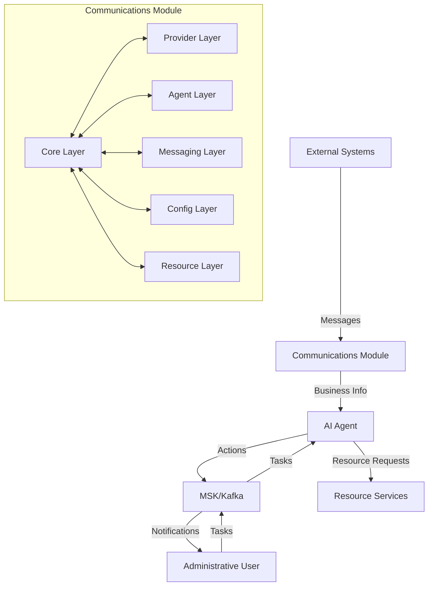
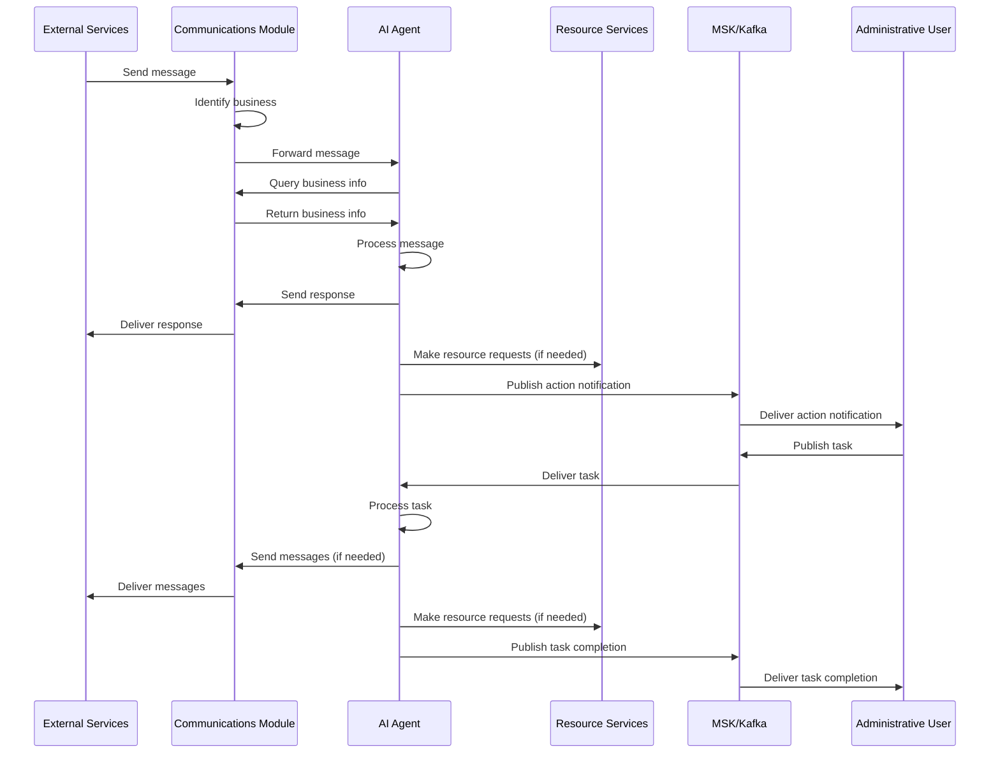

# Design Document

## Overview

This design document outlines the architecture for restructuring the communications module in the AI agent server. The goal is to create a flexible, maintainable system that supports multiple communication channels, businesses, and locations while enabling the AI agent to work autonomously with external services and notify administrative users of actions taken.

## Architecture

The communications module will follow a layered architecture with clear separation of concerns:

1. **Core Layer**: Contains interfaces, models, and base services that define the communication contracts
2. **Provider Layer**: Implements specific communication providers (Meta, Google, Twilio, etc.)
3. **Agent Layer**: Handles interaction with the AI agent for decision making
4. **Messaging Layer**: Manages message routing and Kafka/MSK integration
5. **Config Layer**: Manages business and location configurations
6. **Resource Layer**: Handles interaction with resource services

### High-Level Architecture Diagram



### System Flow Diagram



## Components and Interfaces

### Core Layer

The core layer defines the fundamental interfaces and models that all other components will use:

1. **Channel Interface**: Defines the contract for all communication channels
   - Methods: `isEnabled`, `sendMessage`, `receiveMessages`, `initialize`

2. **Provider Interface**: Defines the contract for communication providers
   - Methods: `isAvailable`, `getConfig`, `validateCredentials`, `initialize`

3. **Message Interface**: Defines the structure of messages across all channels
   - Properties: `id`, `businessId`, `locationId`, `channel`, `from`, `to`, `content`, `timestamp`, `status`

4. **Business Auth Model**: Contains business-specific authentication and authorization information
   - Properties: `businessId`, `businessType`, `enabledFeatures`, `credentials`
   - Methods: `isFeatureEnabled`, `getCredentials`

5. **Location Auth Model**: Contains location-specific authentication and authorization information
   - Properties: `locationId`, `businessId`, `name`, `address`, `enabledFeatures`, `credentials`
   - Methods: `isFeatureEnabled`, `getCredentials`

6. **Business Identifier Service**: Identifies which business a message belongs to
   - Methods: `identifyBusiness`, `validateBusinessAccess`

### Provider Layer

The provider layer implements specific communication providers:

1. **Meta Provider**: Handles Facebook and Instagram integration
2. **Google Provider**: Handles Google services integration
3. **Twilio Provider**: Handles SMS integration
4. **WhatsApp Provider**: Handles WhatsApp integration
5. **Eleven Labs Provider**: Handles voice integration
6. **Email Provider**: Handles email integration

Each provider implements the Provider interface and may contain multiple channels.

### Agent Layer

The agent layer handles interaction with the AI agent:

1. **Agent Communication Service**: Routes messages to and from the AI agent
2. **Agent Decision Service**: Processes agent decisions and routes them to appropriate services
3. **Agent Task Service**: Handles tasks received from administrative users via MSK
4. **Agent Notification Service**: Publishes notifications about agent actions to MSK

### Messaging Layer

The messaging layer manages message routing and Kafka/MSK integration:

1. **Kafka Service**: Handles Kafka message publishing and consumption
2. **MSK Service**: Handles MSK-specific functionality
3. **Message Router Service**: Routes messages between components
4. **Admin Notification Service**: Handles notifications to administrative users

### Config Layer

The config layer manages business and location configurations:

1. **Business Config Service**: Manages business-specific configurations
2. **Location Config Service**: Manages location-specific configurations

### Resource Layer

The resource layer handles interaction with resource services:

1. **Resource Client Service**: Makes requests to resource services
2. **Resource Response Handler**: Processes responses from resource services

## Data Models

### Business Config Entity

```typescript
@Entity('business_configs')
export class BusinessConfig {
  @PrimaryColumn()
  businessId: string;

  @Column({
    type: 'enum',
    enum: BusinessType
  })
  type: BusinessType;

  @Column('jsonb')
  enabledFeatures: BusinessFeatures;

  @Column({ default: true })
  isActive: boolean;

  @CreateDateColumn()
  createdAt: Date;

  @UpdateDateColumn()
  updatedAt: Date;
}
```

### Location Config Entity

```typescript
@Entity('location_configs')
export class LocationConfig {
  @PrimaryColumn()
  locationId: string;
  
  @Column()
  businessId: string;
  
  @Column()
  name: string;
  
  @Column('jsonb')
  address: {
    street: string;
    city: string;
    state: string;
    country: string;
    postalCode: string;
  };
  
  @Column('jsonb', { nullable: true })
  enabledFeatures?: Partial<BusinessFeatures>;
  
  @Column('jsonb', { nullable: true })
  credentials?: {
    [provider: string]: any;
  };
  
  @Column({ default: true })
  isActive: boolean;
  
  @CreateDateColumn()
  createdAt: Date;
  
  @UpdateDateColumn()
  updatedAt: Date;
}
```

### Message Model

```typescript
export interface Message {
  id: string;
  businessId: string;
  locationId?: string;
  channel: string;
  from: string;
  to: string;
  content: {
    text?: string;
    media?: string[];
    metadata?: Record<string, any>;
  };
  timestamp: Date;
  status: 'pending' | 'sent' | 'delivered' | 'read' | 'failed';
}
```

## Error Handling

The system will implement a comprehensive error handling strategy:

1. **Service-Level Error Handling**: Each service will handle its own errors and provide clear error messages
2. **Global Error Interceptor**: A global error interceptor will catch unhandled errors
3. **Error Logging**: All errors will be logged with appropriate context
4. **Error Responses**: API endpoints will return standardized error responses

## Testing Strategy

The testing strategy will include:

1. **Unit Tests**: Test individual components in isolation
2. **Integration Tests**: Test interaction between components
3. **End-to-End Tests**: Test complete workflows
4. **Mock Services**: Use mock services for external dependencies

## Implementation Considerations

1. **Dependency Injection**: Use NestJS dependency injection for loose coupling
2. **Configuration Management**: Use environment variables and configuration files
3. **Scalability**: Design for horizontal scaling
4. **Security**: Implement proper authentication and authorization
5. **Monitoring**: Add logging and monitoring hooks