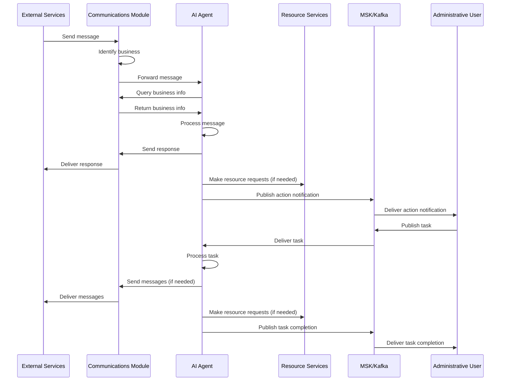

# Requirements Document

## Introduction

This document outlines the requirements for restructuring the communications module in the AI agent server. The goal is to simplify the directory structure, support multiple users, and handle business and location authorizations properly. The restructured module will enable the AI agent to work autonomously with external services, recognize which business the messages are for, and notify administrative users of actions taken.

## Requirements

### Requirement 1

**User Story:** As a developer, I want to restructure the communications module to support multiple communication channels (Meta, Google, Twilio, WhatsApp, Eleven Labs, SMS, Email), so that the AI agent can interact with users through various platforms.

#### Acceptance Criteria

1. WHEN a new communication channel is added THEN the system SHALL integrate it without modifying existing channels
2. WHEN a message is received from any channel THEN the system SHALL route it to the appropriate handler
3. WHEN the system processes messages THEN it SHALL maintain separation between different communication providers
4. WHEN implementing communication channels THEN the system SHALL follow a consistent interface pattern

### Requirement 2

**User Story:** As a developer, I want the communications module to support multiple businesses and locations, so that each business can have its own configuration and authorization settings.

#### Acceptance Criteria

1. WHEN a business is registered THEN the system SHALL store its communication preferences
2. WHEN a location is added to a business THEN the system SHALL allow location-specific communication settings
3. WHEN processing a communication request THEN the system SHALL validate business and location authorization
4. WHEN a business enables or disables a communication channel THEN the system SHALL respect these settings

### Requirement 3

**User Story:** As a developer, I want the AI agent to work autonomously with external services, so that it can respond to messages without requiring administrative user intervention.

#### Acceptance Criteria

1. WHEN a message is received from an external service THEN the system SHALL identify the business it belongs to
2. WHEN the AI agent processes a message THEN it SHALL query business information to properly respond
3. WHEN the AI agent completes a conversation THEN it SHALL be able to make post requests to resource services
4. WHEN the AI agent takes actions THEN it SHALL notify the administrative user via MSK

### Requirement 4

**User Story:** As an administrative user, I want to publish tasks to the agent via MSK and receive notifications about actions taken, so that I can monitor and manage the agent's activities.

#### Acceptance Criteria

1. WHEN an administrative user publishes a task on MSK THEN the agent SHALL receive and process it
2. WHEN the agent completes a task THEN it SHALL publish the results on MSK for the administrative user
3. WHEN the agent takes autonomous actions THEN it SHALL publish notifications on MSK
4. WHEN the agent encounters errors THEN it SHALL publish error information on MSK

### Requirement 5

**User Story:** As a developer, I want a clear separation between message processing and message sending, so that we can implement the sending logic later without changing the core architecture.

#### Acceptance Criteria

1. WHEN designing the architecture THEN the system SHALL separate message processing from message sending
2. WHEN implementing services THEN the system SHALL use interfaces to define communication contracts
3. WHEN the AI agent processes a message THEN the system SHALL define a clear message model for responses
4. WHEN a service needs to be replaced THEN the system SHALL allow this without affecting other components

### Requirement 6

**User Story:** As a developer, I want to ensure that the communications module is testable and maintainable, so that we can easily add features and fix bugs in the future.

#### Acceptance Criteria

1. WHEN implementing services THEN the system SHALL follow dependency injection principles
2. WHEN designing components THEN the system SHALL ensure they are testable in isolation
3. WHEN adding new features THEN the system SHALL maintain backward compatibility
4. WHEN implementing error handling THEN the system SHALL provide clear error messages and logging

## System Flow Diagram

