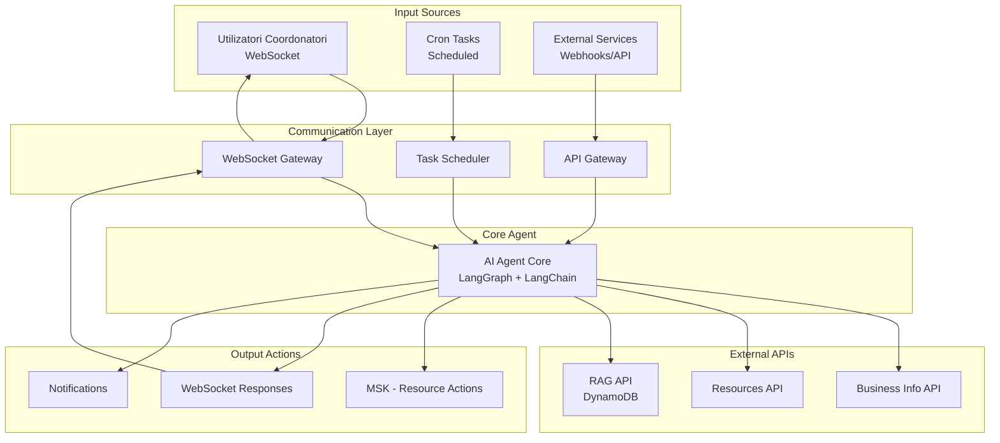
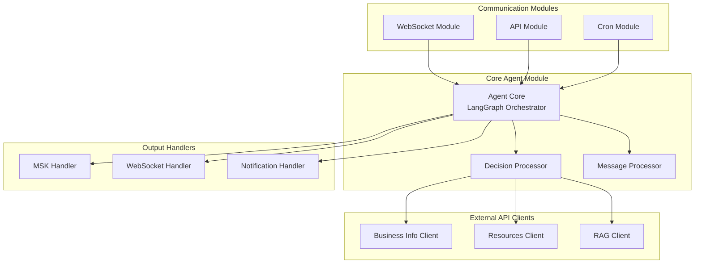

# Design Document

## Overview

Acest document descrie designul pentru implementarea unui sistem de comunicare în timp real între utilizatorii coordonatori și ai-agent-server prin WebSocket. Sistemul va integra LangChain și LangGraph pentru procesarea deciziilor agentului, folosind DynamoDB ca system RAG pentru modelele de mesaje. Agentul va fi stateless și va procesa mesajele în timp real fără a reține conversații.

Sistemul se va integra cu arhitectura existentă a ai-agent-server, extinzând funcționalitatea actuală de comunicare prin Kafka cu o nouă cale de comunicare directă prin WebSocket.

## Architecture

### High-Level Architecture



### Component Architecture



## Components and Interfaces

### 1. Agent Core (LangGraph Orchestrator)

**Responsabilități:**
- Orchestrarea tuturor deciziilor agentului folosind LangGraph
- Procesarea input-urilor din multiple surse (WebSocket, Cron, API)
- Coordonarea apelurilor către API-urile externe
- Generarea acțiunilor și răspunsurilor

**Interfață:**
```typescript
interface AgentCore {
  processInput(input: AgentInput): Promise<AgentOutput>;
  createDecisionWorkflow(): StateGraph;
  executeWorkflow(context: AgentContext): Promise<WorkflowResult>;
}
```

### 2. Business Info Client

**Responsabilități:**
- Comunicarea cu Business Info API
- Cache-uirea informațiilor de business
- Validarea business-ului și location-ului

**Interfață:**
```typescript
interface BusinessInfoClient {
  getBusinessInfo(businessId: string): Promise<BusinessInfo>;
  getLocationInfo(businessId: string, locationId: string): Promise<LocationInfo>;
  validateBusinessAccess(businessId: string, userId: string): Promise<boolean>;
  getCachedBusinessInfo(businessId: string): BusinessInfo | null;
}
```

### 3. Resources Client

**Responsabilități:**
- Comunicarea cu Resources API
- Executarea acțiunilor pe resurse
- Obținerea informațiilor despre resurse

**Interfață:**
```typescript
interface ResourcesClient {
  getResource(businessId: string, resourceType: string, resourceId: string): Promise<Resource>;
  executeAction(action: ResourceAction): Promise<ActionResult>;
  queryResources(businessId: string, query: ResourceQuery): Promise<Resource[]>;
  validateResourceAccess(businessId: string, resourceId: string): Promise<boolean>;
}
```

### 4. RAG Client

**Responsabilități:**
- Comunicarea cu RAG API (DynamoDB)
- Căutarea modelelor de mesaje
- Stocarea și actualizarea modelelor

**Interfață:**
```typescript
interface RAGClient {
  getMessageModel(decisionCode: string): Promise<MessageModel>;
  searchSimilarDecisions(query: string, businessType?: string): Promise<DecisionModel[]>;
  storeDecision(decision: DecisionModel): Promise<void>;
  updateModelUsage(decisionCode: string): Promise<void>;
}
```

### 5. WebSocket Module

**Responsabilități:**
- Gestionarea conexiunilor WebSocket
- Autentificarea utilizatorilor coordonatori
- Routing-ul mesajelor către Agent Core

**Interfață:**
```typescript
interface WebSocketModule {
  handleConnection(client: Socket, auth: AuthToken): Promise<void>;
  handleDisconnect(client: Socket): void;
  handleMessage(client: Socket, message: WebSocketMessage): Promise<void>;
  sendResponse(userId: string, response: AgentResponse): Promise<void>;
  broadcastToBusiness(businessId: string, notification: Notification): Promise<void>;
}
```

### 6. Cron Module

**Responsabilități:**
- Gestionarea task-urilor programate
- Declanșarea acțiunilor periodice
- Monitorizarea stării sistemului

**Interfață:**
```typescript
interface CronModule {
  scheduleTask(task: CronTask): void;
  executeScheduledTasks(): Promise<void>;
  getTaskStatus(taskId: string): TaskStatus;
  cancelTask(taskId: string): void;
}
```

## Data Models

### Agent Input (Unified Input Model)

```typescript
interface AgentInput {
  id: string;
  source: 'websocket' | 'cron' | 'external_api';
  userId?: string;
  businessId: string;
  locationId?: string;
  type: 'user_message' | 'scheduled_task' | 'webhook' | 'api_request';
  content: {
    text?: string;
    data?: Record<string, any>;
    metadata?: Record<string, any>;
  };
  timestamp: Date;
  correlationId?: string;
}
```

### Agent Context

```typescript
interface AgentContext {
  input: AgentInput;
  businessInfo: BusinessInfo;
  locationInfo?: LocationInfo;
  userPermissions?: UserPermissions;
  sessionData?: SessionData;
  ragContext?: RAGContext;
}
```

### Agent Output

```typescript
interface AgentOutput {
  id: string;
  inputId: string;
  decisionCode: string;
  decisionType: string;
  confidence: number;
  reasoning: string;
  actions: AgentAction[];
  responses: AgentResponse[];
  requiresHumanReview: boolean;
  processingTime: number;
  metadata?: Record<string, any>;
}
```

### Agent Action

```typescript
interface AgentAction {
  id: string;
  type: 'resource_action' | 'notification' | 'external_call';
  target: string;
  payload: Record<string, any>;
  priority: 'low' | 'medium' | 'high';
  executeAt?: Date;
  retryPolicy?: RetryPolicy;
}
```

### Agent Response

```typescript
interface AgentResponse {
  id: string;
  target: 'websocket' | 'api' | 'notification';
  recipient: string;
  content: {
    text?: string;
    data?: Record<string, any>;
    template?: string;
  };
  timestamp: Date;
}
```

### Business Info Model

```typescript
interface BusinessInfo {
  businessId: string;
  name: string;
  type: string;
  settings: BusinessSettings;
  locations: LocationInfo[];
  permissions: BusinessPermissions;
  metadata?: Record<string, any>;
}
```

### RAG Context Model

```typescript
interface RAGContext {
  decisionCode: string;
  messageModel?: MessageModel;
  similarDecisions: DecisionModel[];
  businessContext: BusinessContext;
  confidence: number;
}
```

### Message Model (DynamoDB)

```typescript
interface MessageModel {
  decisionCode: string; // Partition Key
  version: number; // Sort Key
  messageTemplate: string;
  parameters: Parameter[];
  businessType?: string;
  locationContext?: string;
  usageCount: number;
  lastUsed: Date;
  createdAt: Date;
  updatedAt: Date;
}
```

### Decision Model (DynamoDB)

```typescript
interface DecisionModel {
  id: string; // Partition Key
  businessId: string; // Sort Key
  decisionCode: string;
  decisionType: string;
  context: string;
  reasoning: string;
  confidence: number;
  outcome: string;
  businessType: string;
  locationId?: string;
  createdAt: Date;
  metadata?: Record<string, any>;
}
```

## Error Handling

### WebSocket Error Types

```typescript
enum WebSocketErrorType {
  AUTHENTICATION_FAILED = 'auth_failed',
  VALIDATION_ERROR = 'validation_error',
  PROCESSING_ERROR = 'processing_error',
  RATE_LIMIT_EXCEEDED = 'rate_limit_exceeded',
  INTERNAL_ERROR = 'internal_error'
}
```

### Error Response Format

```typescript
interface WebSocketErrorResponse {
  type: 'error';
  errorType: WebSocketErrorType;
  message: string;
  details?: any;
  timestamp: Date;
  correlationId?: string;
}
```

### Error Handling Strategy

1. **Connection Errors**: Logare și închiderea conexiunii cu cod de eroare specific
2. **Message Processing Errors**: Returnarea unui răspuns de eroare structurat
3. **System Errors**: Logare detaliată și notificare admin
4. **Rate Limiting**: Implementarea unui sistem de throttling per utilizator

## Testing Strategy

### Unit Testing

- **WebSocket Gateway**: Testarea gestionării conexiunilor și mesajelor
- **LangGraph Processor**: Testarea workflow-urilor de decizie
- **RAG Service**: Testarea interacțiunii cu DynamoDB
- **Decision Classifier**: Testarea clasificării și generării codurilor

### Integration Testing

- **WebSocket End-to-End**: Testarea fluxului complet de la client la agent
- **DynamoDB Integration**: Testarea operațiilor CRUD pe modelele de mesaje
- **MSK Integration**: Testarea publicării acțiunilor pe resurse
- **LangChain Integration**: Testarea procesării cu LLM-uri

### Performance Testing

- **Connection Load**: Testarea cu multiple conexiuni simultane
- **Message Throughput**: Testarea volumului de mesaje procesate
- **Response Time**: Măsurarea timpului de răspuns al agentului
- **Memory Usage**: Monitorizarea consumului de memorie (stateless)

## Security Considerations

### Authentication & Authorization

- **JWT Token Validation**: Validarea token-urilor la conectare
- **Business/Location Permissions**: Verificarea permisiunilor per business/location
- **Rate Limiting**: Limitarea numărului de mesaje per utilizator
- **Input Sanitization**: Validarea și sanitizarea tuturor input-urilor

### Data Protection

- **Message Encryption**: Criptarea mesajelor sensibile
- **Audit Logging**: Logarea tuturor acțiunilor pentru audit
- **Data Retention**: Politici de retenție pentru mesaje și decizii
- **PII Handling**: Gestionarea corespunzătoare a datelor personale

## Monitoring and Observability

### Metrics

- **Connection Metrics**: Numărul de conexiuni active, rate de conectare/deconectare
- **Message Metrics**: Throughput, latency, error rate
- **Agent Metrics**: Timp de procesare, confidence scores, success rate
- **Resource Metrics**: CPU, memory, network usage

### Logging

- **Structured Logging**: Format JSON pentru toate log-urile
- **Correlation IDs**: Tracking-ul mesajelor prin sistem
- **Error Logging**: Logarea detaliată a erorilor cu context
- **Performance Logging**: Logarea timpilor de execuție

### Alerting

- **Connection Alerts**: Alertă la conexiuni eșuate sau rate mari de deconectare
- **Processing Alerts**: Alertă la erori de procesare sau latency mare
- **Resource Alerts**: Alertă la utilizare mare de resurse
- **Business Alerts**: Alertă la decizii cu confidence scăzut

## Deployment Considerations

### Scalability

- **Horizontal Scaling**: Suport pentru multiple instanțe ale serviciului
- **Load Balancing**: Distribuirea conexiunilor WebSocket
- **Session Affinity**: Gestionarea conexiunilor persistente
- **Auto-scaling**: Scaling automat bazat pe load

### High Availability

- **Health Checks**: Endpoint-uri pentru verificarea stării serviciului
- **Graceful Shutdown**: Închiderea corectă a conexiunilor la restart
- **Circuit Breaker**: Protecție împotriva cascading failures
- **Backup Systems**: Fallback la Kafka în caz de probleme WebSocket

### Configuration Management

- **Environment Variables**: Configurare prin variabile de mediu
- **Feature Flags**: Activarea/dezactivarea funcționalităților
- **Dynamic Configuration**: Actualizarea configurației fără restart
- **Secrets Management**: Gestionarea securizată a secretelor